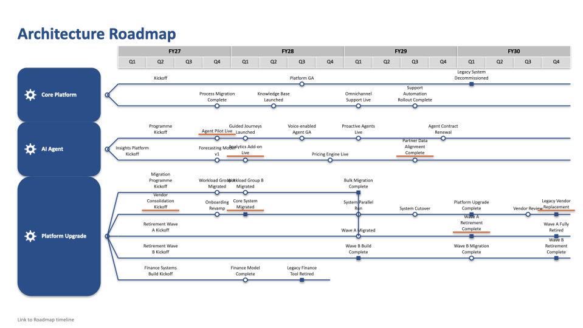

# argenerator

Render architecture roadmaps — a time axis across the top, capability domains down the
side, forking initiative tracks with milestones and deliveries — from a hand-edited YAML
file to a PowerPoint slide.



This is a deterministic renderer: the same YAML always produces the same slide, with no
model in the loop. The YAML file is the durable source of truth (roadmap-as-code);
re-run the CLI any time you edit it.

## Install

```
pip install -e .
```

## Usage

```
argenerator render examples/fictional_company_roadmap.yaml -o roadmap.pptx
argenerator validate examples/fictional_company_roadmap.yaml
```

Options for `render`:

- `--icons DIR` — directory of domain icon images (PNG), overriding the roadmap's
  `icon_dir` and the default `icons/` folder next to the YAML file. Falls back to a
  bundled default gear icon if a domain's `icon` isn't found.
- `--theme FILE` — a YAML/JSON file of colour/font overrides, merged over the built-in
  palette (blue by default). See `argenerator/theme.py` for all overridable fields, e.g.:
  ```yaml
  domain_badge_fill: "#1B4F8C"
  track_line_color: "#1B4F8C"
  milestone_outline: "#1B4F8C"
  ```

Two roadmap-level fields control the footer text. `footer_link_text` defaults to
"Link to Roadmap timeline"; `confidentiality_text` defaults to empty (no watermark) —
set either in the YAML to change or opt in:

```yaml
footer_link_text: "Link to Roadmap timeline"  # set to "" to hide
confidentiality_text: "Highly Confidential"   # empty by default
```

## Roadmap YAML shape

```yaml
title: "Architecture Roadmap"
timeline:
  start: "FY27.Q1"
  end: "FY28.Q4"
domains:
  - name: "Core Platform"
    icon: "gear.png"        # looked up in the resolved icon directory
    tracks:
      - name: "Platform Rebuild"
        events:
          - {type: start, period: "FY27.Q1", label: "Kickoff"}
          - {type: milestone, period: "FY27.Q3", label: "Pilot Live", highlight: true}
          - {type: delivery, period: "FY28.Q2", label: "GA Release"}
dependencies:
  - from_event: "core_platform.platform_rebuild.<event_id>"
    to_event: "other_domain.other_track.<event_id>"
    style: dashed
    label: "enables"
```

- `type` is one of `start` (label only, no marker), `milestone` (hollow circle),
  `delivery` (filled square), or `end` (label only — explicitly stops the track's line
  there instead of running it to the timeline's right edge).
- `id` fields are optional and auto-generated from names/labels if omitted; set them
  explicitly when you need a stable reference for `dependencies`.
- The fork point where a domain's tracks branch out is derived automatically from the
  domain's track list — it isn't authored in the YAML.
- A dependency's `style` is `arrow` or `dashed` for an annotation pointer, or `converge`
  to make the source track's line stop at that event and curve solidly into the target,
  reading as a merge rather than a pointer.

See `examples/` for complete examples:
- `fictional_company_roadmap.yaml` — the roadmap pictured above.
- `fictional_platform_convergence.yaml` — four tracks converging into two, then one.
- `raf_bomber_convergence.yaml` — a short annual (non-quarterly) timeline.

## Tests

```
pytest
```
